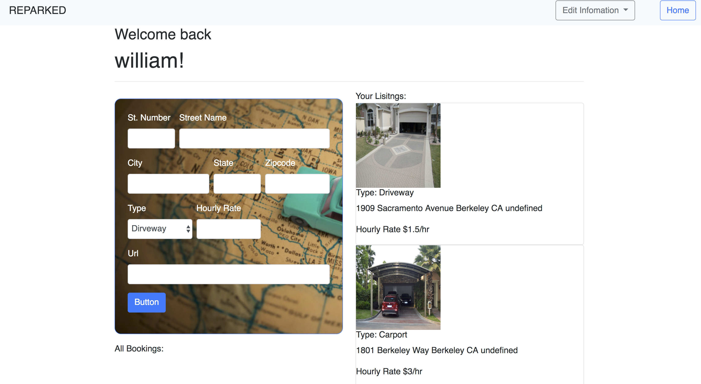

# ReParked
* Deployed on Heroku with JawsDB database solution

https://reparked.herokuapp.com/

Please scroll down for screenshots and database schema

##Who is the app for
* This parking spot sharing app is build for two major groups of users:
    1. Those who drive to work or school where *parking are limited or pricy*.
    2. Those who are *seeking storage space for their vehicle(s)* during vacations or away from home where indoor parkings are not available.

## Motivation
* The inspiration for ReParked came from a real life exprience of one of our developers. He was very excited to begin the immersive coding program, but he did have one serious concern. He lives in San Jose and was planning to drive to the campus in Berkeley and was very worried that he would make the long commute only to have difficulty finding parking! We deciced that there had to be a better solution to this all too common problem.

##Tech Used
The technologies used in creating the project were html 5, css 3, javascript, jQuery, node, express, SQL, googleAPI, sequelized npm, session storage, sha-256 encryption, Heroku, JawsDB

##Features & Instruction
1. Users can choose to sign up as a `host` to post listings and generate income by sharing their spare parking space during work hours or any time they desire. Users can also sign up as `Renters` to make reservations to secure a parking spot for lower premium. 
2. The app allows renter and host to logon their own account and _stay logged in_ during browsing session.
3. `Renters` are able to search by desination address for shared parking in vicinity and _create_ reservation where they see fit. 
4. `Renters` are able log on their accounts to _view_, _edit_, and _delete_ existing reservation of services.
5. `Hosts` are able to log on their account to _create_, _view_, _edit_, and _delete_ their existing lisings and reservations from renters.

##Contribute
Many thanks to Hannah, Dani, Mel, and V for helping us work through the many issues that cropped up during the development period.  

* Developers: 
1. Chunjin (William) Gao 
    `seewilliam.gao@gmail.com`
2. Zhiye (Eric) Mo 
    `zhiyemo09@gmail.com`
3. Jon Laner
    `jonathanlaner@gmail.com`
4. Jose Castellanos
    `castellanos.jd@gmail.com`

##License
MIT

##Screenshots
;
;
;
;

## Datebase Schema
coming soon